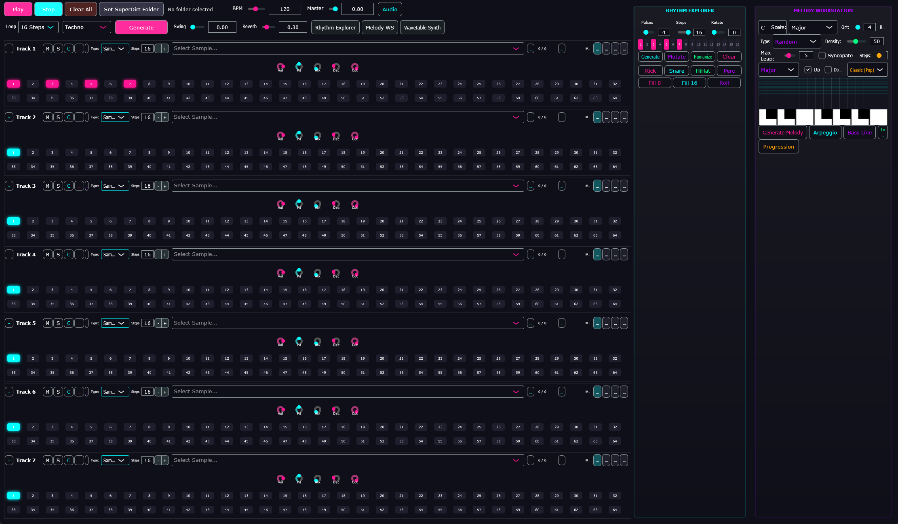
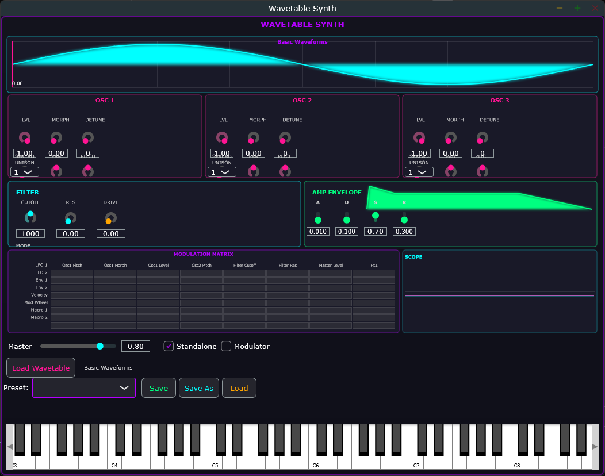

# NeonSakuraStudio

Ein moderner, JUCE-basierter Drum-Sequencer mit Pattern-Generierung, Music-Theory-Features und integriertem Wavetable-Synthesizer im Cyberpunk-Neon-Look.



## Features

### Drum Sequencer
- **8-Track Drum Sequencer** mit 64 Steps
- **Genre-basierte Pattern-Generierung** (Techno, House, Trap, DnB, Ambient, Garage)
- **Euclidean Rhythms** für organische Rhythmen
- **Melodie-Generator** mit Skalen, Arpeggios und Chord Progressions
- **Music Theory Engine** für harmonisch korrekte Patterns
- **Swing & Reverb** für mehr Groove und Atmosphäre
- **Sample-Management** mit Kategorie-basiertem Laden
- **Step Modifiers** (Gain, Pitch, Pan, Ratchet, Reverb, Delay, Filter)

### Wavetable Synthesizer
- **3 Wavetable-Oszillatoren** mit Morphing zwischen Frames und Unison
- **Sub-Oszillator** mit verschiedenen Wellenformen
- **Wavetable-Import** - Lade eigene WAV-Dateien oder Serum-kompatible Wavetables
- **Modulationssystem** mit:
  - 4 LFOs mit verschiedenen Wellenformen und Tempo-Sync
  - 3 Hüllenkurven (ADSR)
  - Flexible Modulation-Matrix
- **Filter-Sektion** mit Lowpass, Highpass, Bandpass, Notch
- **Preset-Management** mit Factory- und User-Presets
- **Echtzeit-Visualisierung** der Wavetable-Wellenform
- **Oszilloskop** für Audio-Ausgabe

### UI
- **Neon-inspiriertes UI** im Cyberpunk-Stil
- **Serum-inspiriertes Synth-Layout**
- **NeonSakuraLook** - Custom LookAndFeel für konsistentes Design
- **Responsive Panels** für verschiedene Arbeitsbereiche

## Screenshots

| Drum Sequencer | Wavetable Synthesizer |
|:--------------:|:---------------------:|
|  |  |

## Abhängigkeiten

- **JUCE 8.0.4** (wird automatisch via CMake FetchContent geladen)
- **melatonin_blur** (für UI-Effekte, wird automatisch geladen)
- **CMake 3.22+**
- **C++20 Compiler**

### Optional
- **super-strudel-desktop** - Für Strudel/TidalCycles-Integration (separates Repository)

## Build

### Windows (Visual Studio)
```bash
mkdir build && cd build
cmake .. -G "Visual Studio 17 2022"
cmake --build . --config Debug
```

### macOS / Linux
```bash
mkdir build && cd build
cmake ..
cmake --build .
```

Die ausführbare Datei befindet sich danach in `build/NeonSakuraStudio_artefacts/Debug/` (Windows) oder `build/` (macOS/Linux).

## Projektstruktur

```
source/
├── Main.cpp                    # Application Entry Point
├── MainComponent.h/cpp         # Haupt-GUI und Audio-Setup
│
├── Audio/
│   ├── AudioEngine.h/cpp       # Audio-Processing und Playback
│   ├── TrackAudioProcessor.h/cpp # Audio-Processing pro Track
│   ├── SampleManager.h/cpp     # Sample-Verwaltung
│   └── PlaybackController.h/cpp # Playback-Steuerung
│
├── Core/
│   ├── TrackModel.h/cpp        # Datenmodell für Tracks
│   ├── TrackManager.h/cpp      # Track-Verwaltung
│   ├── TrackType.h             # Track-Typ Definitionen
│   ├── PanelManager.h/cpp      # Panel-Management
│   └── ITrackDataProvider.h    # Interface für Track-Daten
│
├── Sequencer/
│   ├── PatternGenerator.h/cpp  # Genre-basierte Pattern-Generierung
│   ├── RhythmExplorer.h/cpp    # UI für rhythmische Exploration
│   ├── MusicTheory.h/cpp       # Skalen, Akkorde, Progressions
│   ├── MelodyGenerator.h/cpp   # Melodische Pattern-Generierung
│   └── MelodyPanel.h/cpp       # UI für Melodie-Workstation
│
├── UI/
│   └── TrackComponent.h/cpp    # UI für einen Track
│
├── WavetableSynth/             # Wavetable Synthesizer Engine
│   ├── WavetableData.h/cpp     # Wavetable-Daten und -Laden
│   ├── WavetableOscillator.h/cpp # Oszillator mit Unison/Morphing
│   ├── SubOscillator.h/cpp     # Sub-Oszillator
│   ├── WavetableFilter.h/cpp   # Filter-Implementierung
│   ├── WavetableVoice.h/cpp    # Stimme mit Filter/Hüllenkurve
│   ├── WavetableSynth.h/cpp    # Synthesiser mit Voices
│   ├── WavetableEngine.h/cpp   # Standalone Engine
│   ├── WavetableParams.h/cpp   # Thread-sichere Parameter
│   ├── WavetablePreset.h/cpp   # Preset-Datenstruktur
│   └── WavetablePresetManager.h/cpp # Preset-Verwaltung
│
├── WavetableUI/                # Synthesizer UI
│   ├── WavetableSynthEditor.h/cpp # Haupt-Editor
│   ├── WavetableDisplay.h/cpp  # Wavetable-Visualisierung
│   ├── OscillatorSection.h/cpp # Oszillator-Controls
│   ├── FilterSection.h/cpp     # Filter-Controls
│   ├── EnvelopeSection.h/cpp   # Hüllenkurven-Controls
│   ├── ModulationGrid.h/cpp    # Modulation-Matrix UI
│   ├── Oscilloscope.h/cpp      # Audio-Visualisierung
│   └── NeonSakuraLook          # Custom LookAndFeel
│
└── Modulation/                 # Modulationssystem
    ├── ModulationMatrix.h/cpp  # Routing-System
    ├── ModulationSource.h      # Quellen-Definitionen
    ├── Modulator.h             # Basis-Klasse
    ├── LFOModulator.h/cpp      # LFOs
    └── EnvelopeModulator.h/cpp # Hüllenkurven
```

## Step Modifiers

Jeder Step im Sequencer kann folgende Modifiers haben:

| Modifier | Taste | Beschreibung |
|----------|-------|--------------|
| Gain | g | Lautstärke pro Step |
| Pitch | p | Pitch-Shift in Halbtönen |
| Pan | n | Stereo-Position |
| Ratchet | r | Schnelle Wiederholungen |
| Reverb | v | Reverb-Anteil |
| Delay | d | Delay-Anteil |
| Filter | f | Filter-Cutoff |

## Modulation Matrix

Der Wavetable-Synthesizer bietet eine flexible Modulations-Matrix:

**Quellen (Sources):**
- LFO 1-4
- Envelope 1-3
- Velocity, ModWheel, PitchBend, Aftertouch
- Macro 1-4

**Ziele (Targets):**
- Oszillator Pitch, Wavetable Position, Level
- Filter Cutoff, Resonance
- Pan, Amp

## Entwicklung

### Kompilieren
```bash
cmake --build build --config Debug
```

### Release Build
```bash
cmake --build build --config Release
```

## Lizenz

MIT

---

*NeonSakuraStudio - Cyberpunk Music Production*
